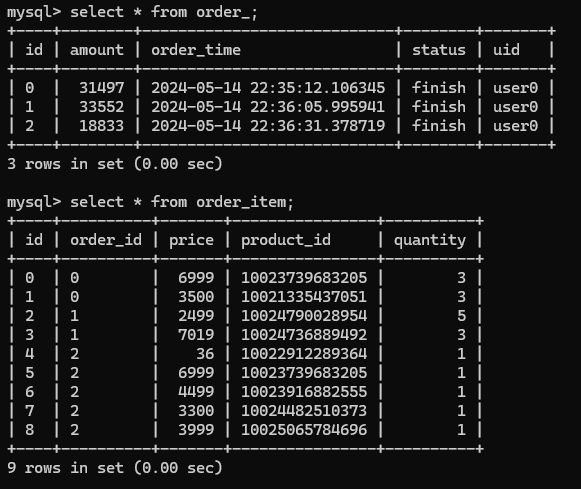
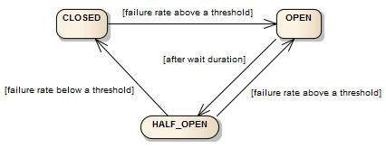
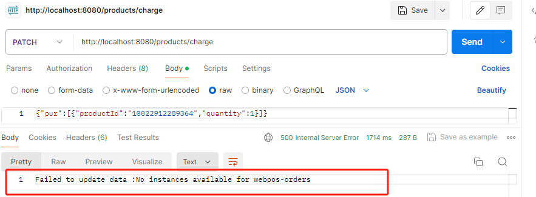
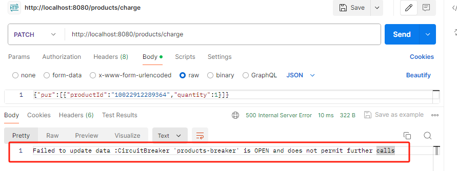
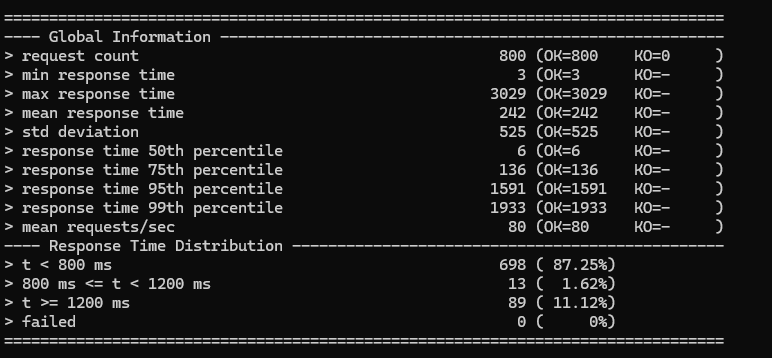
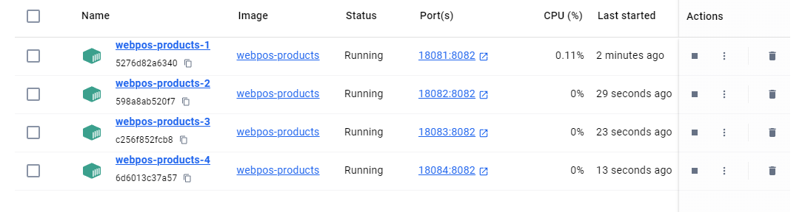
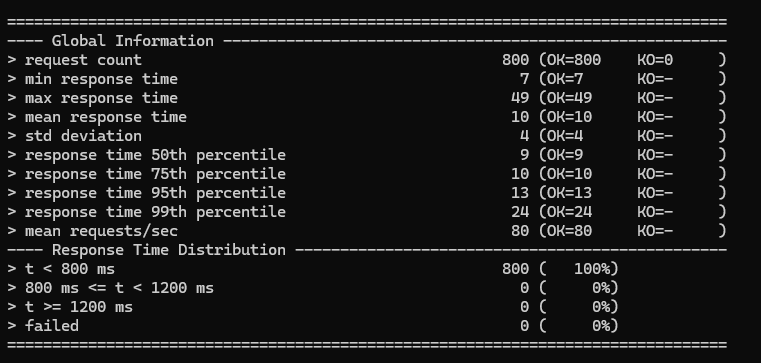
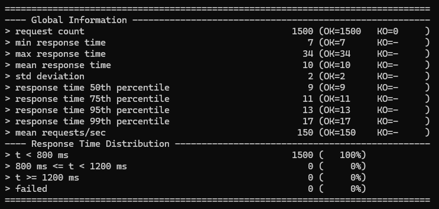
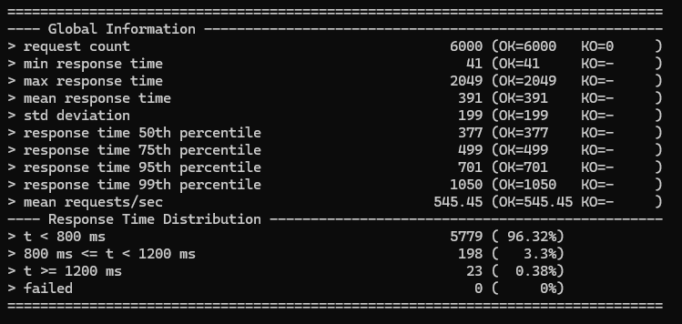

# aw06 Micro WebPos

本次作业将aw05中的RESTful Webpos进行了大改，改成了微服务架构的Webpos。前端的js代码也做出了修改。

- 包含五个服务：`webpos-api`、`webpos-discovery`、`webpos-gateway`、`webpos-orders`、`webpos-products`。

- 同时为项目接入了MySQL数据库，实现了数据持久化管理。并对`webpos-products`模块进行了水平扩展、进行了压力测试，验证了单个服务水平扩展提高系统性能。
- `webpos-products`服务使用了`@LoadBalance`的`RestTemplate`访问`webpos-orders`的服务，实现服务间协同、购物下单的流程。
- 使用了断路器`resilience4j.circuitbreaker`的机制（spring cloud gateway的断路器），实现了故障保护，避免连锁式的调用服务失败导致系统不可用。

目前效果：

**实现前端维护页面、购物车。后端各模块注册到8761端口`webpos-discovery`这个`eureka`注册中心进行服务发现。前端发送的请求到8080端口的网关`webpos-gateway`，由网关进行对应的路由转发。用户下单时，发送`patch`请求到网关，网关转发到8082端口的`webpos-products`服务，该服务进行数据库商品数量修改，并利用`restTemplate`进行跨服务调用8083端口的`webpos-orders`创建订单。**

后台MySQL的webpos数据库有三张表：**`webpos-products`维护的商品信息表`product`、`webpos-orders`维护的订单表`order_`以及订单条目表`order_item`.**（这里订单维护两张表是为了数据库规范特意设计的。因为一次下单，购物车内会有多个物品，即一个订单可能设计多项商品）。

order_表字段：

| 订单id（主键） | 下单用户id | 订单总金额 | 订单状态(未完成、已完成) | 下单时间  |
| -------------- | ---------- | ---------- | ------------------------ | --------- |
| id             | uid        | amount     | status                   | orderTime |

order_item表字段：

| 订单条目id（主键） | 对应的订单id（外键） | 商品id（外键） | 数量     | 单价  |
| ------------------ | -------------------- | -------------- | -------- | ----- |
| id                 | orderId              | productId      | quantity | price |

演示：

买了三次东西，每次商品种类、数量不同。可以看到后台数据存货发生变化，且生成订单：




## 服务介绍

### webpos-api

主要定义了一些各个服务需要共用的api。本项目中只涉及数据传输共用的DTO（Data Transfer Object）。DTO的作用是将服务中的实体Entity抽象成对应的DTO，这样跨服务传输数据只需要传输DTO而不需要顾及服务内部Entity的设计。这样的好处是降低耦合度，提高代码复用性。需要实现Mapper来进行实体与DTO之间的映射。

本服务定义了三个DTO:`ProductDTO`、`OrderDTO`、`OrderItemDTO`。


### webpos-discovery

服务发现模块。用到了`Eureka`这个用于构建和管理分布式系统中的服务注册和发现的工具。在微服务架构中，服务通常会动态地启动、停止和扩展，因此需要一种机制来帮助服务找到彼此并建立通信。

配置在`discovery.yml`文件中。这个`Eureka Server`运行在本机8761号端口上。其他服务模块作为`Eureka Client`都需要到8761号端口进行服务注册。


### webpos-gateway

微服务的网关模块，运行在8080端口上。网关对外部隐藏了其他微服务模块的信息，任何访问微服务的请求必须先到达网关，然后由网关进行路由转发到对应的服务模块。这有利于简化微服务架构中的通信管理和安全控制，提高系统的可维护性、安全性和性能。

相关路由规则配置在`gateway.yml`文件中。由于前端发送的请求`content-type`是`application/json`，且是`post/patch`方法，会触发浏览器的预检请求`options`.（这与浏览器的同源策略cors：`Cross-Origin Resource Sharing`）有关。因此为了使得正确响应前端请求，网关中还要额外配置metadata来允许options请求，设置`allowOrigins: '*'`表示接收所有域的请求：

```yaml
- id: Product
  uri: http://localhost:8082
  predicates:
- Path=/products/**
  metadata:
    cors:
      allowedOrigins: '*'
      allowedMethods:
		- GET
		- POST
		- PATCH
		- OPTIONS
	  allowedHeaders: '*'
	  maxAge: 30
```


### webpos-products

最主要的模块：运行在8082端口上的商品模块。核心代码与上个作业差不多。主要介绍下不同点：

- 之前是基于内存的h2数据库，每次服务启动都会重新去JD爬取数据，这样如果有多个节点，每个节点都会有自己的h2数据库，这会造成数据不一致现象。因此这次作业改成了MySQL。
- 之前没有DTO，不利于微服务间数据传输。这次作业加入了DTO，`controller`返回的是DTO对象。
- 之前前端下单都是购物车每项商品发送一个patch请求，这次对前后端都做出修改：一个购物车只发送一条请求，后端统一处理。
- 加入了断路器的机制。
- 利用RestTemplate访问`webpos-orders`模块。

核心购物函数：相关解释看注释

```java
@PatchMapping("/products/charge")
@CircuitBreaker(name = "products-breaker", fallbackMethod = "fail")//使用@CircuitBreaker注解，说明该函数使用名为`products-breaker`的断路器，当调用失败时会进入fallback函数`fail`
public ResponseEntity<String> charge(@RequestBody ChargeRequest request) {
    System.out.println("in charge!");
    double total = 0;
    OrderDTO orderDTO = new OrderDTO("user0", 0, new ArrayList<>(), "finish");//创建一个订单DTO

    for (ProductUpdateRequest p : request.getPur()) {
        System.out.println(p.getProductId() + " " + p.getQuantity());
        Product product = productService.getProductById(p.getProductId());
        if (product == null || product.getQuantity() < p.getQuantity()) {//先判断库存是否充足
            //库存不足返回400
            return ResponseEntity.status(HttpStatus.BAD_REQUEST).body("Product not existed or no enough quantity!");
        }

        total += Double.parseDouble(product.getPrice()) * p.getQuantity();
        orderDTO.getItems().add(new OrderItemDTO(p.getProductId(), p.getQuantity(), Double.parseDouble(product.getPrice())));//对每一项商品创建一个对应的OrderItemDTO.
    }
    orderDTO.setAmount(total);//设置订单金额
    //创建订单。通过RestTemplate访问webpos-orders服务，进行真正的订单创建，参数为orderDTO，返回值String
    String ret = restTemplate.postForObject("http://webpos-orders/createOrder", orderDTO, String.class);
    //创建订单成功，且没抛出异常，才会修改库存
    request.getPur().forEach(p -> {
        productService.updateProduct(p.getProductId(), productService.getProductById(p.getProductId()).getQuantity() - p.getQuantity());
    });
    return ResponseEntity.ok("Data updated! orders return : " + ret);
}
//断路器的fallback函数：函数签名需与上一个函数一致，除了参数需要多一个Throwable。
public ResponseEntity<String> fail(ChargeRequest request, Throwable throwable) {
    System.out.println("Circuit breaker triggered, fallback method called.");
    return ResponseEntity.status(HttpStatus.INTERNAL_SERVER_ERROR).body("Failed to update data :" + throwable.getMessage());
}
```

断路器与数据库的配置也在`products.yml`文件中：

```yaml
spring:
  application:
    name: webpos-products
  datasource:
    driver-class-name: com.mysql.cj.jdbc.Driver
    url: jdbc:mysql://localhost:3306/webpos # 连接数据库的地址
    username: root
    password: root
  jpa:
    database: MySQL
    database-platform: org.hibernate.dialect.MySQLDialect
    show-sql: true
    hibernate:
      ddl-auto: update # 如果表不存在则创建表

server:
  port: 8082 # products服务运行端口

eureka:
  client:
    serviceUrl:
      defaultZone: http://localhost:8761/eureka/ # 指出注册中心的url，products服务作为Eureka Client到server去进行服务注册
    instance:
      leaseRenewalIntervalInSeconds: 10 # 服务实例续约租期的时间间隔为10秒

resilience4j: # 使用resilience4j断路器
  circuitbreaker:
    instances:
      products-breaker: # 定义断路器实例products-breaker
        sliding-window-type: COUNT_BASED # 基于计数的滑动窗口
        failure-rate-threshold: 50 # 故障率，对于滑动窗口内请求，故障率超出50，触发断路器开启
        minimum-number-of-calls: 5 # 最小调用数：必须超过5次才开始进入断路器机制
        automatic-transition-from-open-to-half-open-enabled: true # 断路器自动从开启转为半开启状态，允许放行一些请求
        wait-duration-in-open-state: 5s # 开启状态等5s进入半开启
        permitted-number-of-calls-in-half-open-state: 3 # 半开启状态下允许通过的请求数
        sliding-window-size: 10 # 滑动窗口的大小
        register-health-indicator: true # 注册健康指标，用于评估系统的状态，通常用于决定何时打开或关闭断路器。
```

对断路器的理解：



1. CLOSED状态时，请求正常放行
2. 请求失败率达到设定阈值时，变为OPEN状态，此时请求全部不放行
3. OPEN状态持续设定时间后，进入半开状态（HALE_OPEN），放过部分请求
4. 半开状态下，失败率低于设定阈值，就进入CLOSE状态，即全部放行
5. 半开状态下，失败率高于设定阈值，就进入OPEN状态，即全部不放行

经过我postman请求的实践：关闭`webpos-orders`服务来令所有下单请求失效，然后利用postman向后端调用上面的`charge`函数，验证了断路器在发生作用：

**当请求次数过少或故障率不够高时，断路器没有开启，但是只要charge函数触发异常，就会调用fallback函数！！此时Throwable参数的异常信息是：`Failed to update data :No instances available for webpos-orders`.**



**当请求次数达到10个后，由于每次都失败，断路器开启，同样调用fallback函数，但是Throwable的异常信息发生了变化：**



显示断路器开启，阻止了更深的调用。


### webpos-orders

运行在8083端口的订单服务，主要作用是被`webpos-products`服务调用，来进行订单创建。`OrderController`维护两个不断自增的id作为`order_`和`order_item`表的主键，工作流程是：从products接收待完善的`OrderDTO`对象、`OrderItemDTO`对象，填入订单时间和对应的主键id，并利用jpa插入MySQL的对应表中。具体代码与`webpos-products`服务类似，不再阐释。


## 水平扩展webpos-products并压力测试


利用gatling进行压力测试。10秒渐进访问量800：

```java
scn.injectOpen(rampUsers(800).during(10))
```

**单节点的`webpos-products`模块结果如下**：



800个中有1.62%响应时间在800~1200ms,有11.12%响应时间>=1200ms.


**接下来利用haproxy进行水平扩展**。`haproxy.cfg`：

```
defaults
    mode tcp
frontend webpos
    bind *:18080
    default_backend servers
backend servers
    balance roundrobin
    server server1 localhost:18081
    server server2 localhost:18082
    server server3 localhost:18083
    server server4 localhost:18084
```

水平扩展成四个后端`webpos-products`节点,分别在18081、18082、18083、18084四个端口。主节点在8080端口进行roundrobin轮询负载均衡。

然后利用docker部署四个节点，分别从8082端口（`webpos-products`默认开启的端口）映射到18081/18082/18083/18084四个端口：


由于我项目里DTO需要跨模块共享，因此放在了单独的`webpos-api`模块。而`webpos-products`服务依赖于`webpos-api`.要想单独打包`webpos-products`服务必须先将`webpos-api`进行`mvn install`到本地maven仓库。**但是我遇到了jdk层面的bug**：[[JDK-8252883\] AccessDeniedException caused by delayed file deletion on Windows - Java Bug System (openjdk.org)](https://bugs.openjdk.org/browse/JDK-8252883)

为了能水平扩展`webpos-products`模块，只好暂时把DTO移到该模块内部，再打包`webpos-products`模块。


(期间又遇到了很多问题。。首先是在docker上部署的后端无法通过localhost访问本机上的MySQL服务器：这个改成通过本机真实ip连接后成功；然后是MySQL服务器不允许远程访问，因为docker ip默认是172.17.0.1，MySQL默认只允许root@localhost访问。解决：通过命令修改user表，使得所有ip都能访问：`mysql> update user set host = '%' where user = 'root';`)


终于完成部署了：


**接下来对haproxy监听的18080端口进行压力测试**：

800用户量轻轻松松：



1500用户量小菜一碟：

测试一下极限6000：

到6000，终于性能有一点下滑。经过测试6000~7000就是瓶颈，多余这个数会导致大量failed：主要是数据库select的性能瓶颈。